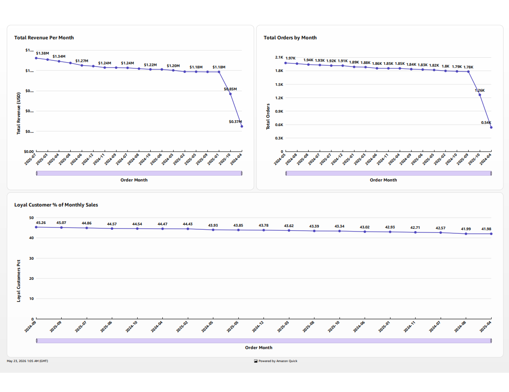
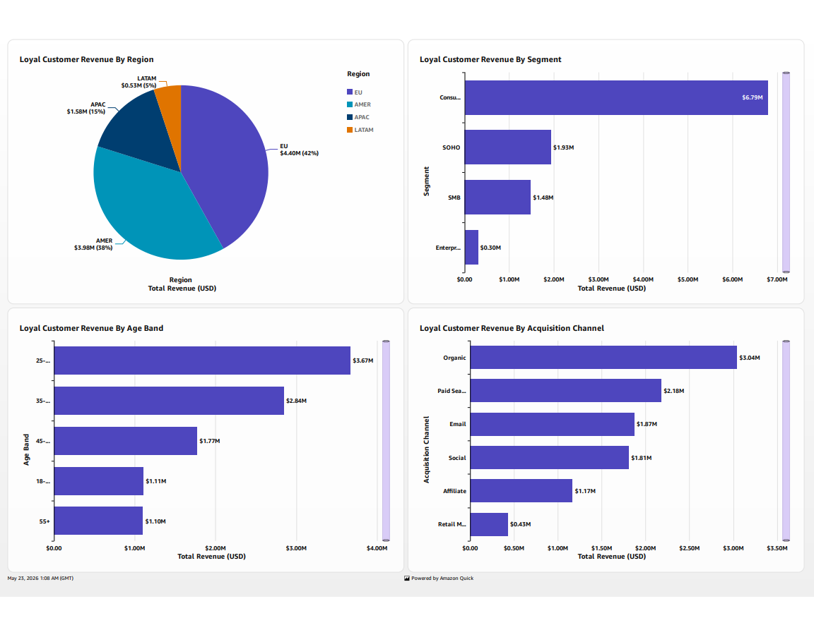
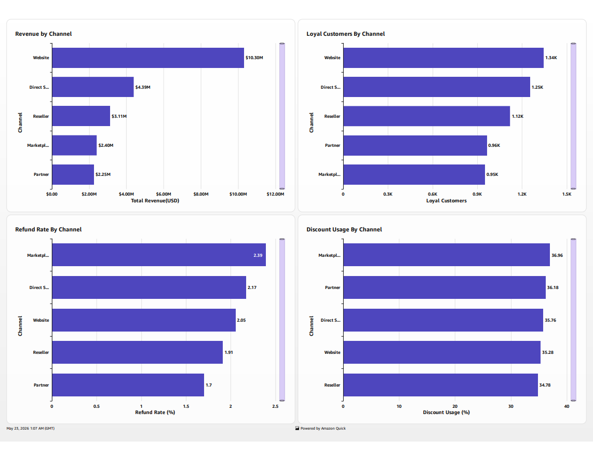
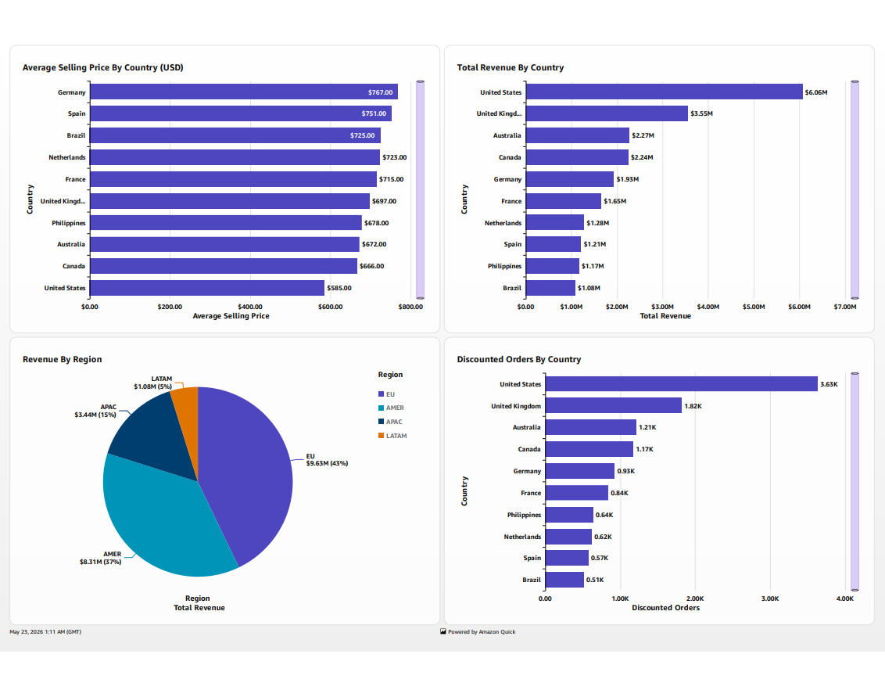
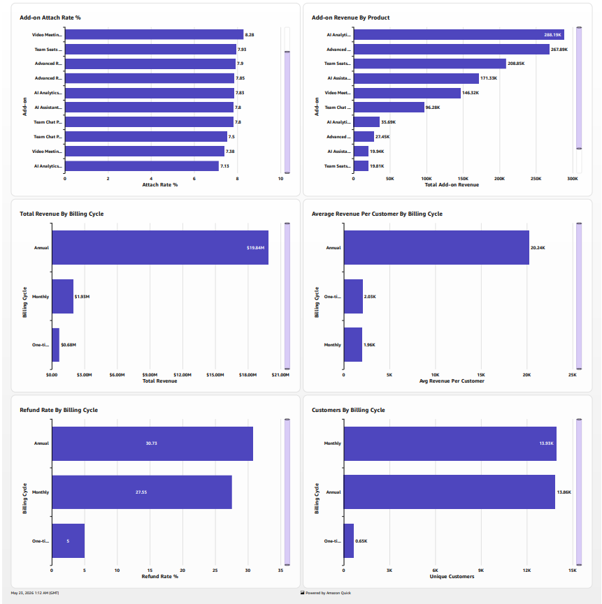
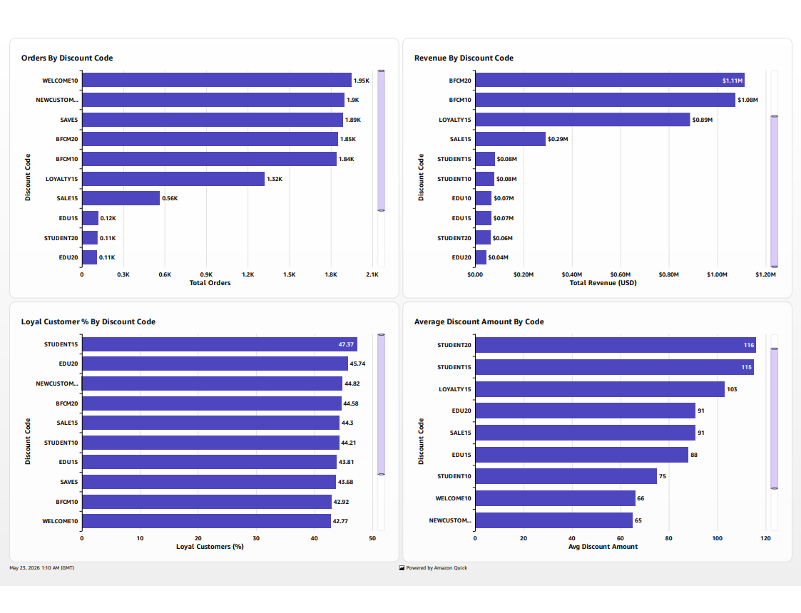

# E-Commerce Analytics — AWS Data Engineering Project


An end-to-end cloud-native ELT data engineering project on AWS analysing e-commerce sales data from a global software retailer. The pipeline ingests raw transaction data, transforms it through a medallion architecture, and delivers a six-sheet business intelligence dashboard that answers 12 analytical questions about customer loyalty, revenue drivers, and promotional performance.

Built as a portfolio project following the **AWS Certified Data Engineer – Associate (DEA-C01)** certification.

---

## Dashboard

| Sales Overview | Customer Loyalty |
|---|---|
|  |  |

| Channel Performance | Pricing & ASP |
|---|---|
|  |  |

| Product Performance & Billing | Discount Analysis |
|---|---|
|  |  |

---

## dbt Lineage


---

## Architecture

```
Excel Source
     │
     ▼
export_sheets.py → 3 CSV files
     │
     ▼  aws s3 cp
S3 Raw Bucket (Bronze)
     │
     ▼  Glue Crawler
Glue Data Catalog
     │
     ▼  Redshift COPY
raw schema — Bronze layer
     │
     ▼  dbt staging
silver schema — stg_events · stg_products · stg_customers
     │
     ▼  dbt intermediate
silver schema — int_customer_orders · int_loyal_customers
               int_product_performance · int_discount_usage
     │
     ▼  dbt marts
gold schema — 7 physical tables
     │
     ▼
Amazon QuickSight — 6-sheet dashboard
```

---

## Tech Stack

| Concern | Tool |
|---|---|
| Infrastructure | Terraform |
| Storage | Amazon S3 |
| Schema discovery | AWS Glue Crawler + Data Catalog |
| Data warehouse | Amazon Redshift Serverless |
| Transformation | dbt Core |
| Visualisation | Amazon QuickSight |

---

## Dataset

**Source:** DataDNA E-Commerce Dataset Challenge — November 2025

| Table | Rows | Contents |
|---|---|---|
| events | 48,000 | Orders and invoices — revenue, channel, discount, refund data |
| products | 101 | Product catalog — categories, billing cycles, pricing |
| customers | 4,000 | Customer profiles — segments, regions, acquisition channels |

The retailer sells software subscriptions and add-ons across analytics, design, collaboration, and AI categories to customers across 10 countries.

---

## Medallion Architecture

**Bronze** — Raw CSV files are loaded into Redshift via the `COPY` command without any transformation. This layer is the immutable source of truth. If anything goes wrong downstream, bronze is the recovery point.

**Silver** — dbt staging models clean and enrich the bronze data. Type casting, null handling, region enrichment (US and Canada had no region assigned in the source; derived from country), discount code standardisation, and derived date columns are all applied here. dbt intermediate models then compute business logic; purchase history per customer, loyalty flags, discount performance, and product metrics; joining across the three staging models.

**Gold** — Seven dbt mart models are materialised as physical tables in Redshift. These are the final reporting layer, designed specifically to answer the 12 guiding business questions. QuickSight connects directly to these tables.

---

## dbt Models

### Staging
| Model | Role |
|---|---|
| `stg_events` | Cleans raw events — casts types, fills missing regions, standardises discount codes, adds `order_month` / `order_year` / `order_quarter` |
| `stg_products` | Cleans product catalog, derives `is_addon` flag from category |
| `stg_customers` | Cleans customer profiles, fills missing regions |

### Intermediate
| Model | Role |
|---|---|
| `int_customer_orders` | Purchase history per customer — order count, revenue, first/last purchase dates, days to second purchase |
| `int_loyal_customers` | Loyalty flag (10+ orders), joined with customer profile |
| `int_product_performance` | Revenue and order metrics per product with catalog attributes |
| `int_discount_usage` | Discount code usage, revenue, and loyal customer conversion rate |

### Marts
| Model | Business Question |
|---|---|
| `mart_sales_by_month` | How do total sales and loyal customer share change over time? |
| `mart_channel_performance` | Which channels drive revenue, loyalty, and refunds? |
| `mart_loyal_customers` | Who are the loyal customers and what are their profiles? |
| `mart_discount_analysis` | Which discount codes are most used and do they drive repeat purchases? |
| `mart_asp_by_country` | What is the average selling price by country and currency? |
| `mart_addon_attach_rate` | Which add-ons are most frequently purchased alongside core products? |
| `mart_billing_cycle_revenue` | Do annual plans generate more revenue per customer than monthly? |

---

## Key Findings

**Revenue and loyalty**
Loyal customers — defined as those with 10 or more orders; represents 34% of the customer base but consistently account for 42–45% of monthly revenue. Revenue peaked at $1.38M in July 2025 and declined gradually through the dataset period, with the last two months showing a sharper drop likely due to incomplete data.

**Channel performance**
Website is the dominant channel at $10.3M total revenue and 1,340 loyal customers; more than double any other channel. Marketplace has the highest refund rate at 2.39% and the highest discount usage at 36.96%, suggesting a more price-sensitive buyer profile. Partner channel has the lowest refund rate at 1.7%.

**Geography and pricing**
EU accounts for 43% of total revenue. Germany has the highest average selling price at $767 while the United States, despite generating the most total revenue at $6.06M, has the lowest ASP at $585. The US also accounts for the most discounted orders at 3.63K; more than three times the next country.

**Customer segments**
Consumer segment loyal customers generate $6.79M; more than SOHO, SMB, and Enterprise combined. The 25–34 age band is the strongest by revenue at $3.67M. Organic acquisition produces the most loyal customer revenue at $3.04M, outperforming paid search, email, and social.

**Discounts**
WELCOME10 and NEWCUSTOMER10 are the most frequently used codes. Black Friday codes (BFCM10, BFCM20) drive the most absolute revenue. STUDENT15 has the highest loyal customer conversion rate at 47.37%, suggesting student discounts strongly predict long-term retention.

**Billing and products**
Annual plans generate $19.84M vs $1.93M for monthly, and $20,240 average revenue per customer vs $1,960; a 10x difference. Annual plans carry a higher refund rate at 30.73% vs 27.55% for monthly. Add-on attach rates are broadly even across products, ranging from 7–8%.

---

## Infrastructure

All AWS resources are provisioned with Terraform. The infrastructure is fully reproducible — `terraform apply` provisions everything from scratch and `terraform destroy` removes it cleanly.

Resources created:
- S3 raw bucket with versioning, AES-256 encryption, and public access blocked
- IAM roles for Glue (read-only S3 access) and Redshift (S3 read for COPY, Glue catalog read)
- Glue Data Catalog database and crawler pointed at the raw S3 bucket
- VPC with two subnets, internet gateway, and security group locked to the operator IP
- Redshift Serverless namespace and workgroup at 8 RPUs

The project uses Redshift Serverless which qualifies for a $300 free trial credit for first-time users, making it cost-effective for development and portfolio work.

---

## Services

Services used in this project: Amazon S3, AWS Glue, AWS Glue Data Catalog, Amazon Redshift Serverless, Amazon QuickSight, AWS IAM, Amazon VPC, Amazon CloudWatch.

---

## Author

**Samuel Lartey**
AWS Certified Data Engineer – Associate
