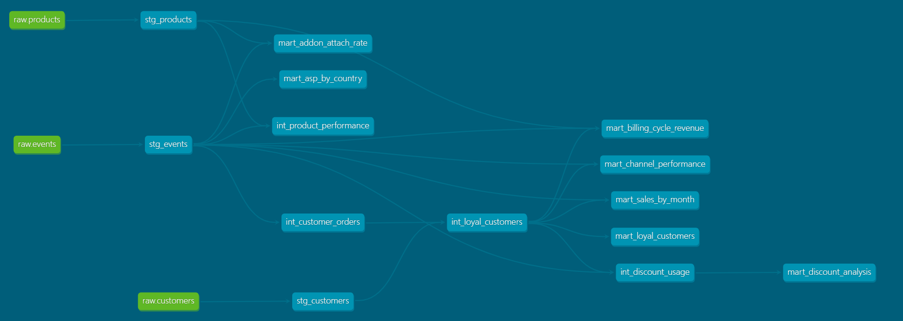

# E-Commerce Analytics — AWS Data Engineering Project


An end-to-end cloud-native ELT data engineering project on AWS that analyses e-commerce sales data from a global software retailer to identify loyal customers and uncover the channels, products, and promotions that drive repeat purchases.

Built as a portfolio project to apply skills from the **AWS Certified Data Engineer – Associate (DEA-C01)** certification.

---

## Dashboard

| Sales Overview | Customer Loyalty |
|---|---|
|  |  |

| Channel Performance | Pricing & ASP |
|---|---|
|  |  |

| Product Performance & Billing | Discount Analysis |
|---|---|
|  |  |

---

## dbt Lineage



The lineage graph shows how data flows from the three raw source tables through the staging and intermediate layers into the seven gold mart tables consumed by QuickSight.

---

## Architecture

```
Excel Source File
       │
       ▼
export_sheets.py ──► 3 CSV files (events, products, customers)
       │
       ▼
S3 Raw Bucket  ◄── aws s3 cp
       │
       ▼
AWS Glue Crawler ──► Glue Data Catalog (schema registered)
       │
       ▼
Redshift COPY ──► raw schema (Bronze layer)
       │
       ▼
dbt Staging ──► silver schema
(stg_events, stg_products, stg_customers)
       │
       ▼
dbt Intermediate ──► silver schema
(int_customer_orders, int_loyal_customers,
 int_product_performance, int_discount_usage)
       │
       ▼
dbt Marts ──► gold schema (7 physical tables)
       │
       ▼
Amazon QuickSight ──► 6-sheet dashboard
```

---

## Medallion Architecture

| Layer | Location | Description |
|---|---|---|
| **Bronze** | `raw` schema in Redshift | Raw CSV data loaded via COPY command — untouched source of truth |
| **Silver** | `silver` schema in Redshift | dbt staging + intermediate views — cleaned, typed, enriched, business logic applied |
| **Gold** | `gold` schema in Redshift | dbt mart tables — final aggregations consumed directly by QuickSight |

---

## Tech Stack

| Layer | Tool |
|---|---|
| Infrastructure as Code | Terraform |
| Storage | Amazon S3 |
| Schema Discovery | AWS Glue Crawler + Data Catalog |
| Data Warehouse | Amazon Redshift Serverless |
| Transformation | dbt Core |
| Visualisation | Amazon QuickSight |
| Version Control | Git + GitHub |

---

## Dataset

**Source:** DataDNA E-Commerce Dataset Challenge — November 2025

A global software retailer selling subscriptions and add-ons across analytics, design, collaboration, and AI tools.

| Table | Rows | Description |
|---|---|---|
| `events` | 48,000 | Orders and invoices with revenue, channel, discount, and refund data |
| `products` | 101 | Product catalog with categories, billing cycles, and pricing |
| `customers` | 4,000 | Customer profiles with segments, regions, and acquisition channels |

---

## Project Structure

```
ecomm-analytics/
├── data/
│   ├── export_sheets.py          # Exports Excel source to 3 CSV files
│   └── csv/                      # Generated CSVs (gitignored)
├── infrastructure/
│   ├── main.tf                   # Terraform provider config
│   ├── variables.tf              # Input variable declarations
│   ├── s3.tf                     # S3 raw bucket
│   ├── iam.tf                    # IAM roles for Glue and Redshift
│   ├── glue.tf                   # Glue Data Catalog and crawler
│   ├── redshift.tf               # Redshift Serverless namespace and workgroup
│   └── outputs.tf                # Terraform outputs
├── ecomm_dbt/
│   └── models/
│       ├── staging/              # Silver — cleaning and enrichment
│       │   ├── stg_events.sql
│       │   ├── stg_products.sql
│       │   ├── stg_customers.sql
│       │   ├── sources.yml
│       │   └── stg_events.yml
│       ├── intermediate/         # Silver — business logic
│       │   ├── int_customer_orders.sql
│       │   ├── int_loyal_customers.sql
│       │   ├── int_product_performance.sql
│       │   └── int_discount_usage.sql
│       └── marts/                # Gold — reporting tables
│           ├── mart_sales_by_month.sql
│           ├── mart_channel_performance.sql
│           ├── mart_loyal_customers.sql
│           ├── mart_discount_analysis.sql
│           ├── mart_asp_by_country.sql
│           ├── mart_addon_attach_rate.sql
│           └── mart_billing_cycle_revenue.sql
├── assets/                       # Dashboard screenshots and dbt DAG
├── .gitignore
└── README.md
```

---

## dbt Models

### Staging Layer (Views — Silver schema)
Reads from raw Bronze tables. Applies type casting, null handling, column standardisation, and data enrichment. No business logic.

| Model | Key Transformations |
|---|---|
| `stg_events` | Casts timestamps and numerics, fills missing US/Canada regions from country lookup, converts `N/A` discount codes to nulls, adds `order_month`, `order_year`, `order_quarter` |
| `stg_products` | Casts types, trims strings, derives `is_addon` flag from category |
| `stg_customers` | Casts types, fills missing US/Canada regions from country lookup |

### Intermediate Layer (Views — Silver schema)
Joins staging models and computes business concepts. No direct consumption by QuickSight.

| Model | Description |
|---|---|
| `int_customer_orders` | Order history per customer — total orders, revenue, first/last purchase dates, days to second purchase |
| `int_loyal_customers` | Flags customers with 10+ orders as loyal, joins with full customer profile |
| `int_product_performance` | Revenue, order counts, and ASP per product joined with product catalog |
| `int_discount_usage` | Discount code performance — usage counts, revenue, and loyal customer conversion rate |

### Mart Layer (Tables — Gold schema)
Final aggregated tables consumed directly by Amazon QuickSight.

| Model | Guiding Questions Answered |
|---|---|
| `mart_sales_by_month` | How do total sales change by month? What % of monthly sales comes from loyal customers? |
| `mart_channel_performance` | Which channels bring the most sales and loyal customers? Where do refunds happen most? |
| `mart_loyal_customers` | Full loyal customer profiles — spend, lifespan, segment, acquisition channel |
| `mart_discount_analysis` | Which discount codes are used most? Do they increase repeat purchases? |
| `mart_asp_by_country` | What is the average selling price by country and currency? |
| `mart_addon_attach_rate` | Which add-ons are most often bought alongside core products? |
| `mart_billing_cycle_revenue` | Do annual plans bring higher revenue per customer than monthly plans? |

---

## Key Findings

- **Loyal customers (10+ orders)** represent 34% of the customer base but consistently drive **42–45% of monthly revenue**
- **Website** is the dominant channel at **$10.3M revenue** and **1,340 loyal customers** — more than double any other channel
- **Annual plans generate 10x more revenue per customer** than monthly plans ($20,240 vs $1,960)
- **EU accounts for 43% of total revenue** — Germany leads ASP at $767 while the US generates the most total revenue at $6.06M despite the lowest ASP at $585
- **Consumer segment** loyal customers generate **$6.79M** — more than SOHO ($1.93M), SMB ($1.48M), and Enterprise ($0.30M) combined
- **STUDENT15** has the highest loyal customer conversion rate at **47.37%** — student discounts strongly predict long-term retention
- **Organic acquisition** produces the most loyal customer revenue at **$3.04M** — outperforming paid search, email, and social
- **Black Friday codes (BFCM10, BFCM20)** drive the most absolute revenue at $1.08M and $1.11M respectively
- **Marketplace** has the highest refund rate (2.39%) and highest discount usage (36.96%) — suggesting price-sensitive buyers

---

## QuickSight Dashboard

Six sheets covering all 12 guiding questions from the DataDNA challenge:

| Sheet | Charts |
|---|---|
| Sales Overview | Total revenue by month, total orders by month, loyal customer % of monthly sales |
| Customer Loyalty | Revenue by region, segment, age band, and acquisition channel |
| Channel Performance | Revenue, loyal customers, refund rate, discount usage by channel |
| Pricing & ASP | ASP by country, revenue by country and region, discounted orders by country |
| Product Performance & Billing | Add-on attach rates, revenue by billing cycle, revenue per customer, refund rate by billing cycle |
| Discount Analysis | Orders, revenue, loyal customer %, average discount amount by code |

---

## Reproducing This Project

### Prerequisites
- AWS account with admin permissions
- Terraform >= 1.3.0
- Python >= 3.9
- dbt-core and dbt-redshift

### 1. Clone the repo
```bash
git clone https://github.com/Sammy-Lartey/ecomm-analytics.git
cd ecomm-analytics
```

### 2. Set up Python environment
```bash
python -m venv .venv

# Windows
.venv\Scripts\activate

# Mac/Linux
source .venv/bin/activate

pip install dbt-core dbt-redshift boto3 awscli openpyxl
```

### 3. Export the dataset to CSV
```bash
python data/export_sheets.py
```

### 4. Provision AWS infrastructure
```bash
cd infrastructure
cp terraform.tfvars.example terraform.tfvars
# Fill in: your IP address, Redshift admin password, region
terraform init
terraform apply
```

### 5. Upload CSVs to S3
```bash
aws s3 cp data/csv/events.csv    s3://<raw-bucket>/events.csv
aws s3 cp data/csv/products.csv  s3://<raw-bucket>/products.csv
aws s3 cp data/csv/customers.csv s3://<raw-bucket>/customers.csv
```

### 6. Run the Glue crawler
```bash
aws glue start-crawler --name <crawler-name> --region us-east-1
```

### 7. Load raw data into Redshift
In Redshift Query Editor v2, create the `raw` schema, create the three tables, then run a `COPY` command for each table using the Redshift IAM role ARN from the Terraform outputs.

### 8. Connect dbt and run models
```bash
cd ecomm_dbt
dbt debug        # verify Redshift connection
dbt run          # build all 14 models
dbt test         # run data quality tests
dbt docs generate && dbt docs serve   # view lineage graph
```

### 9. Connect QuickSight
Connect Amazon QuickSight to Redshift Serverless on port 5439. Import the seven gold mart tables as SPICE datasets and build the dashboard.

### 10. Tear down when done
```bash
cd infrastructure
terraform destroy
```

---

## Cost

This project uses **Amazon Redshift Serverless** which offers a **$300 free trial credit** for first-time users, valid for 90 days. All other services (S3, Glue, IAM, VPC) are either free tier or negligible cost. Run `terraform destroy` when not actively working to avoid idle charges.

---

## Certification

Built to demonstrate skills from the:

**AWS Certified Data Engineer – Associate (DEA-C01)**

AWS services covered: Amazon S3, AWS Glue, AWS Glue Data Catalog, Amazon Redshift Serverless, Amazon QuickSight, AWS IAM, Amazon VPC, Amazon CloudWatch.

---

## Author

**Samuel Lartey**
AWS Certified Data Engineer – Associate
[GitHub](https://github.com/Sammy-Lartey) · [LinkedIn](#)
